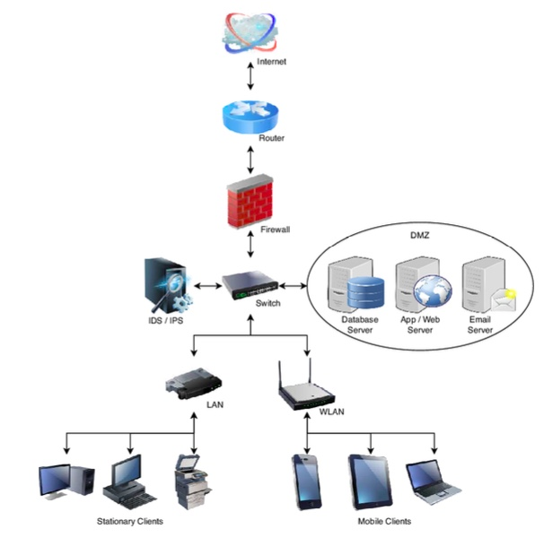

# 🛡️ Análise de Vulnerabilidades em Arquitetura de Rede (UC Segurança em Redes e Computadores)

---

## Visão Geral do Projeto

Este repositório documenta um projeto de análise de segurança focado na identificação e mitigação de vulnerabilidades numa arquitetura de rede de média dimensão. O objetivo foi aplicar os princípios de **Confidencialidade, Integridade e Disponibilidade (CIA)** para reforçar a postura de segurança do sistema.

O trabalho foi desenvolvido no âmbito da Unidade Curricular de **Segurança em Redes e Computadores (21181)** da Licenciatura em Engenharia Informática, cuja nota final foi **20/20**.

---

## 🗺️ Conteúdo do Repositório

* **`./enunciado/`**: Imagem do esquema de rede e descrição do problema original (autorizado pelo docente).
* **`./relatorio/`**: Relatório de análise e proposta de mitigação em formato PDF.
* **`./scripts_e_dados/`**: Scripts Python utilizados para a demonstração criptográfica.

---

### Esquema de Rede Analisado

Este é o diagrama de rede original que serviu como base para a análise de vulnerabilidades.

## 🔑 Metodologia de Análise e Modelação de Ameaças

A análise seguiu uma abordagem estruturada, identificando pontos críticos de falha, modelando possíveis caminhos de ataque e propondo controlos de segurança por camadas (**Defesa em Profundidade**).

### 1. Vulnerabilidades Críticas Identificadas

Foram identificadas cinco vulnerabilidades arquitetónicas que aumentavam significativamente o risco de comprometimento da rede:

1.  **Falta de Segmentação WLAN/LAN:** Permitia o **movimento lateral** de ataques devido à ausência de *firewall* interna e VLANs.
2.  **Posicionamento Incorreto do IDS/IPS:** O sistema de deteção/prevenção de intrusões estava em modo paralelo, falhando em monitorizar o tráfego de entrada e permitir a passagem de tráfego malicioso.
3.  **Exposição do Database Server:** O servidor com dados sensíveis estava incorretamente posicionado na DMZ, violando o princípio da Defesa em Profundidade.
4.  **Exposição de Servidores Públicos:** O WebServer e o Email Server estavam vulneráveis devido ao mau posicionamento do IDS/IPS.
5.  **Firewall Única:** Criação de um **ponto único de falha** no perímetro da rede.

### 2. Exemplos de Modelação de Ataque (Attack Trees)

Foram desenvolvidos diagramas de Árvores de Ataque, demonstrando vetores de exploração para objetivos específicos.

| Objetivo | Vetores de Ataque | Ameaças Chave |
| :--- | :--- | :--- |
| **Roubo de Dados** (Database Server na DMZ) | SQL Injection, Phishing para obter credenciais, Brute-force SSH | Roubo de informação sensível, Destruição de dados |
| **Controlar Rede Interna** (Execução de Ransomware) | Comprometimento do dispositivo móvel via Phishing ou Man-in-the-Middle (Wi-Fi), seguido de **Movimento Lateral** da WLAN para a LAN | Infeção por ransomware, Sniffing |

---

## 💡 Soluções e Controlos de Segurança Propostos

A estratégia de mitigação focou-se na implementação de controlos ativos e passivos, transformando a rede numa infraestrutura defensável.

| Controlo Proposto | Ação de Mitigação | Princípios Reforçados |
| :--- | :--- | :--- |
| **Segmentação e Isolamento** | Criação de **VLANs** e implementação de uma **Firewall Interna** com regras ACL para isolar a WLAN da LAN. | Confidencialidade e Integridade |
| **Monitorização do Perímetro** | Reposicionamento do IDS/IPS em modo **in-line** e instalação de um **WAF (Web Application Firewall)**. | Confidencialidade e Integridade |
| **Autenticação Forte** | Implementação de **MFA (Autenticação Multifator)** para acessos administrativos e VPN. | Confidencialidade |
| **Redundância/DRP** | Implementação de **UPS** para servidores críticos e Plano de Contingência (DRP) com backups off-site. | Disponibilidade |

---

## 🔐 Demonstração Criptográfica Híbrida

Como parte da solução, foi demonstrada a importância e a implementação de uma solução criptográfica híbrida (`AES+RSA`) em Python, que garante a confidencialidade e integridade das comunicações.

* **AES (Simétrico):** Usado para a encriptação/decifração **rápida** de volumes de dados.
* **RSA (Assimétrico):** Usado para a troca **segura** da chave de sessão AES, resolvendo o problema de gestão de chaves da encriptação simétrica.

O código de demonstração deste esquema híbrido pode ser encontrado na secção `./scripts_e_dados/`.

---

## 📚 Tecnologias Chave / Referências

* **Ferramentas Lógicas:** Modelação de Ameaças (Threat Modeling), Princípios CIA, Defesa em Profundidade.
* **Implementação:** Python, Biblioteca `cryptography.hazmat.primitives` (AES-GCM e RSA-OAEP).
* **Referências Académicas:** Stallings, W. (Computer Security), OWASP Foundation, NCSC (Attack Trees).
